# プレ演習

## 何をやるの？

- JupyterHub にアクセスします (P00-P01)
- R のノートブックを開きます (P02-P03)
- ターミナルも開きます (P04)

## 実習用環境の簡単な説明

Jupyter notebook はRを使うインターフェースの一つです。JupyterHubはたくさんのユーザに統一的なJupyter notebookの実行環境を提供するサーバーです。

受講者の皆さんは、JupyterHubにアクセスし、Jupyter notebookでRを使います。また、実習に使用するデータをダウンロードします。

## P00: 自分のユーザ名とパスワードを確認しましょう

> **ユーザ名とパスワードはmanabaに記載してあります**

## P01: JupyterHub へアクセスする

> **URLはmanabaに記載してあります**

アクセスすると下図のような画面が表示されます。`ADVANCED`をクリックしてください（下図、矢印）。

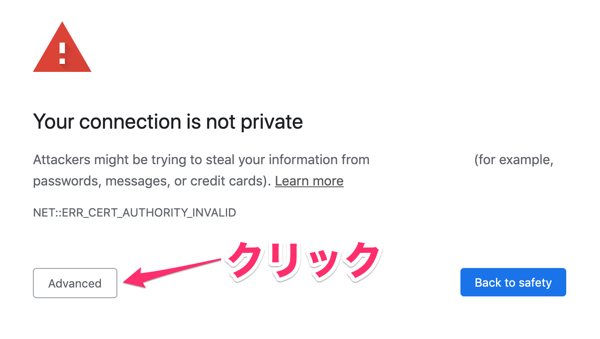


さらに、`Proceed to [IPアドレス] (unsafe)` をクリックします。

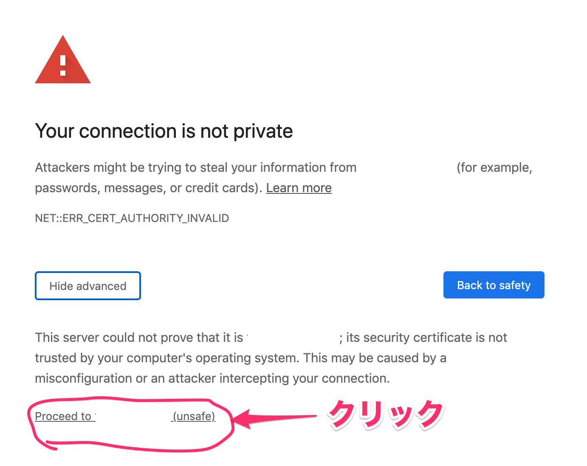

すると、下図のようなログイン画面がでてきます。事前に配布したユーザ名とパスワードを入力して `Sign in` をクリックします。

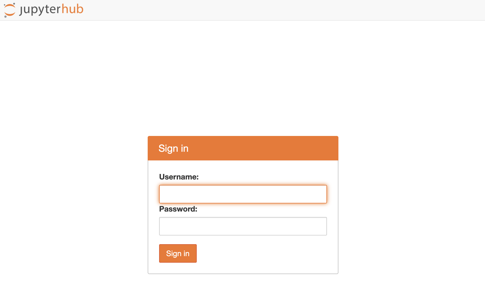

下図の画面が出たらログイン成功です。

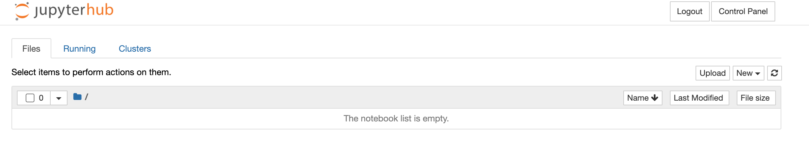


## P02: R のノートブックを開く

"New" のボタンをクリックします。

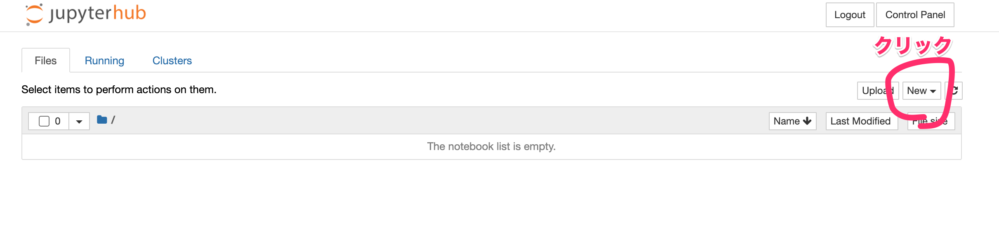

"R" を選択します。

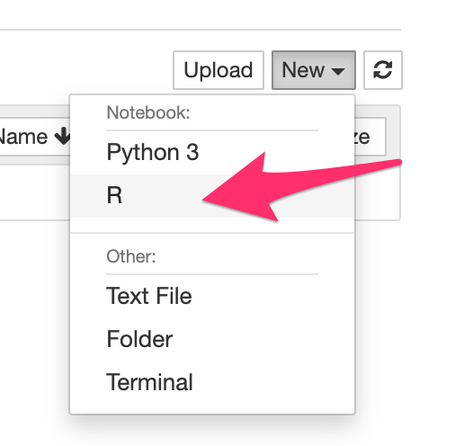

新しいタブが開き、下図のように右上に "R"と書かれていたら成功です。

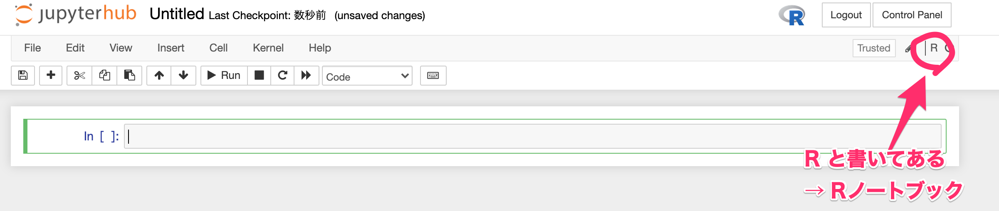

"+"のボタンを押した分だけセルが増えます。

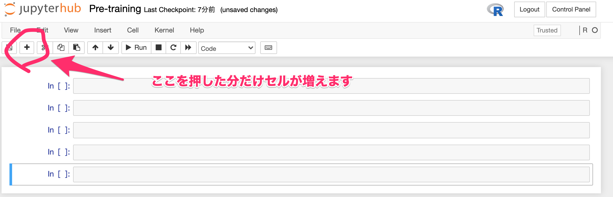

## P03: R をテストしてみる

"Untitled" となっている部分をクリックすると、このノートブックのファイル名を変更できます。
ファイル名を "Pre-training" と変更しましょう。

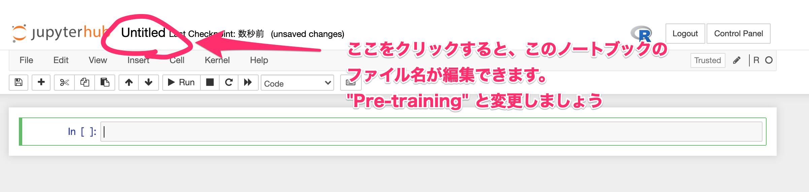

この部分はセルと呼びます。ここにコードを書いたりできます。

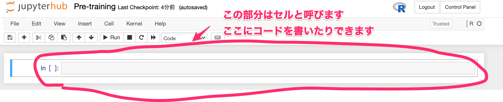

Run を押すと、選択しているセルのコードが実行されます。

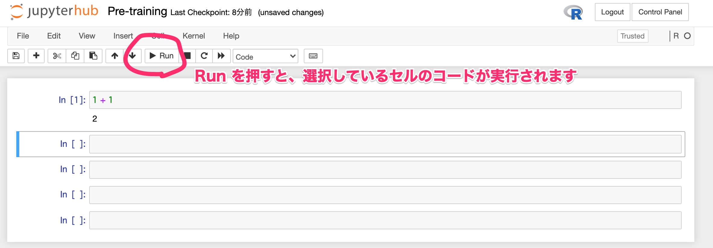

## P04: ターミナルを開く

ターミナルを起動します。`New`をクリックするとメニューが表示されます。その中から`Terminal`をクリックします。


すると新しいタブでターミナル（黒い画面）が表示されます。
`ls` を実行すると、 `Pre-training.ipynb` が出力されるはずです。

```bash
$ ls
```

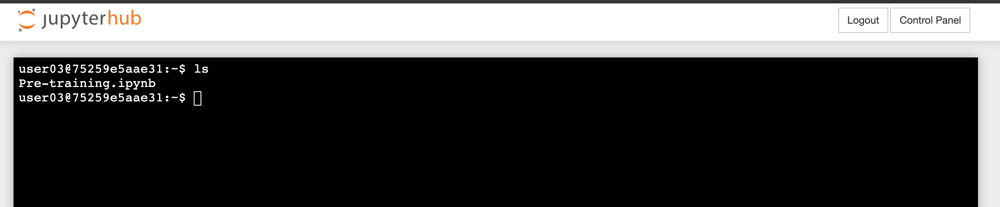

