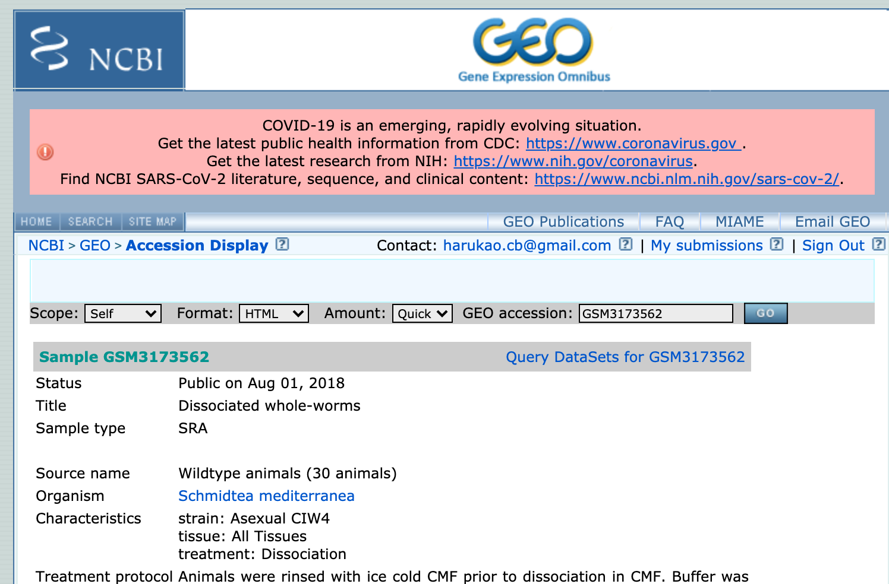

# 演習B

- [演習B](#演習b)
  - [何をやるの？](#何をやるの)
    - [プラナリア？](#プラナリア)
    - [どんなデータ？](#どんなデータ)
    - [１細胞RNA-seq解析の基本的な流れ](#１細胞rna-seq解析の基本的な流れ)
  - [1. データのありかにアクセスし、ダウンロードリンクを得る](#1-データのありかにアクセスしダウンロードリンクを得る)
  - [2. 必要なファイルをダウンロードする](#2-必要なファイルをダウンロードする)
  - [3. Seurat でコードを実行する](#3-seurat-でコードを実行する)
  - [基本課題](#基本課題)
    - [基本課題B-1](#基本課題b-1)
  - [発展課題](#発展課題)
    - [発展課題B-1](#発展課題b-1)
    - [発展課題B-2](#発展課題b-2)
- [演習B 追記](#演習b-追記)
  - [実行済みファイルについて](#実行済みファイルについて)
  - [課題について](#課題について)
    - [基本課題B-1について](#基本課題b-1について)
    - [発展課題B-1について](#発展課題b-1について)
  - [R で途中の結果までを保存する `saveRDS()` について](#r-で途中の結果までを保存する-saverds-について)

## 何をやるの？

- プラナリアの一細胞RNA-seqデータを解析します

### プラナリア？

- 切っても再生する生き物
- https://en.wikipedia.org/wiki/Schmidtea_mediterranea


### どんなデータ？

- 元論文
  - Comparative transcriptomic analyses and single-cell RNA sequencing of the freshwater planarian Schmidtea mediterranea identify major cell types and pathway conservation https://genomebiology.biomedcentral.com/articles/10.1186/s13059-018-1498-x
  - freshwater planarian *Schmidtea mediterranea*
  - Drop-seq
- プラナリアの scRNA-seq データ解析
  - https://www.ncbi.nlm.nih.gov/geo/query/acc.cgi?acc=GSE115280
  - cluster markers https://figshare.com/articles/Additional_file_4/6852896
  - https://genomebiology.biomedcentral.com/articles/10.1186/s13059-018-1498-x


### １細胞RNA-seq解析の基本的な流れ

今回は１細胞RNA-seq解析でよく使われる [Seurat （すーら）](https://satijalab.org/seurat/) というパッケージを使用します。

Drop-seqという１細胞RNA-seqの場合、どの細胞がどんな細胞型かがわからない。そこで、個々の細胞がどんな細胞かを「遺伝子発現のみから」明らかにする必要がある。この作業を細胞型アノテーション（Cell type annotation）と呼びます。

- 1. 遺伝子発現のカウント行列を読み込む
  - 行が遺伝子数 x 列が細胞、各要素がある遺伝子のある細胞でのリードカウントになっている
- 2. 品質の低い細胞をフィルターする
  - 実験手法の制約から全ての細胞が良い品質のデータに変換されているわけではない
  - ここでは、 `nFeature_RNA` （ある細胞で検出された遺伝子の数）、 `nCount_RNA` (ある細胞のリードカウントの合計) が低い細胞を除く（高い細胞だけを選ぶ）
- 3. 発現量データを正規化する
  - 細胞ごとにリードカウントの合計値が違う場合、元のカウントを細胞間で比較しても意味がない
    - 遺伝子発現量は「割合」に近いイメージ
  - そこで、細胞間で遺伝子発現量を比較できるように、カウントデータを正規化する
- 4. 高変動遺伝子（highly variabe genes) を抽出する
  - 全ての遺伝子の発現量が重要なわけではない
  - 「個々の細胞の細胞型の違い・多様性」を見分けるためには、「細胞間で発現量が異なる遺伝子」を見なければならない
  - そこで「細胞間で発現量が大きく変動している遺伝子」を抽出する
    - この際、遺伝子によっては「ノイズ」のように変動するものもあるため、統計学的に有意に高い変動を示す遺伝子を抽出することが重要
- 5. 発現量データをスケーリングする
  - 細胞のアノテーションの前段階として、細胞のクラスタリングを行いたい
    - 計算処理の高速化や計測ノイズをならす意味がある
  - 細胞のクラスタリングには、遺伝子たちを変数として使用する
  - この際、このままでクラスタリングすると、発現量が大きい遺伝子の影響が大きくなる
  - そのため、遺伝子間での発現量のスケールを揃える（スケーリング）ことが必要となる
- 6. PCA（主成分分析）を用いて次元削減を行う
  - クラスタリングの前に次元圧縮をすることで、データの多様性をなるべく損ねずに効率的にクラスタリングができる
  - PCAはデータの多様性をなるべく損ねずに次元圧縮できる
- 7. 細胞をクラスタリングする
- 8. 各クラスターに特徴的な遺伝子群を探す
- 9 各クラスターがどんな細胞型かを類推する
  - 遺伝子機能の知識が不足している場合は、オーソログの情報を使うと良い


## 1. データのありかにアクセスし、ダウンロードリンクを得る

- GEO (Gene Expression Omnibus) は米国NCBIが運営する、マイクロアレイやNGSデータのデータレポジトリ


[https://www.ncbi.nlm.nih.gov/geo/query/acc.cgi?acc=GSE115280](https://www.ncbi.nlm.nih.gov/geo/query/acc.cgi?acc=GSM3173562)にアクセスすると、こんなページが出る



下の方にスクロールし、 `(ftp)` を **右クリック** し（Macの場合はctrl+クリックも可）、リンクのアドレスをコピーする


## 2. 必要なファイルをダウンロードする

ターミナルを開き、以下を実行する

```bash
# data というディレクトリへ移動する
$ cd data

# ダウンロードする
$ wget ftp://ftp.ncbi.nlm.nih.gov/geo/samples/GSM3173nnn/GSM3173562/suppl/GSM3173562_Lakshmipuram_NCBI_processeddata.txt.gz

# 解凍する
$ gunzip GSM3173562_Lakshmipuram_NCBI_processeddata.txt.gz
```

```bash
# 行数を調べる
$ wc -l GSM3173562_Lakshmipuram_NCBI_processeddata.txt

# 中身を見てみる
$ less GSM3173562_Lakshmipuram_NCBI_processeddata.txt
```

## 3. Seurat でコードを実行する

[planarian_single_cell.ipynb](planarian_single_cell.ipynb) 


## 基本課題

### 基本課題B-1

- [planarian_single_cell.ipynb](planarian_single_cell.ipynb) をダウンロードし、実行せよ
- 上のメニューから `File > Download as > HTML (.html)` とすることで、実行結果をダウンロードできるので、それを manaba で提出せよ

## 発展課題

### 発展課題B-1

- 各クラスターに特異的な遺伝子群がどのような機能を持つ遺伝子かを調べ、レポートとしてまとめよ
  - 少なくとも３つのクラスターについて調べよ
- 様式は以下の通りにする。様式が満たされていない場合は０点とする。
  - ファイル形式：Word
  - ページ数：２ページ以内（ギリギリまで書いた方が成績が良いという意味ではない、例えば２ページでも満点になりうる）
  - フォント：サイズは 10ポイント、そのほかは自由
  - 構成：
    - タイトル
    - 氏名
    - 学籍番号
    - 目的（本課題の目的を書く）
    - 方法
    - 結果（どんな遺伝子が多かったか）
    - 考察（結果がこれまで）
    - 結論（目的を達成できたかを結果に基づいて書く）


### 発展課題B-2

- この論文 https://doi.org/10.1016/j.bbrc.2020.03.044 ではヒトの13の組織において ACE2など SARS-COV2 の感染に関連する受容体の発現を調査している
- Table S1 (Excelファイル) を参考に好きな組織の１細胞RNA-seqデータをダウンロードし、 [planarian_single_cell.ipynb](planarian_single_cell.ipynb) を参考に、データ前処理・解析を行い、ACE2遺伝子の発現量が高い細胞があるかを調べよ
- 上のメニューから `File > Download as > HTML (.html)` とすることで、実行結果をダウンロードできるので、それを manaba で提出せよ

# 演習B 追記

## 実行済みファイルについて

- 実行済みのノートブックもアップロードしました
  - [planarian_single_cell_Executed.ipynb](planarian_single_cell_Executed.ipynb)
- [planarian_markers.rds](planarian_markers.rds) をRで読み込むことで、細胞クラスター特異的遺伝子群を用いた解析を実施できます
- また、B01からB16の結果の `planarian` も公開しました（ファイルサイズが大きいため、figshareというサービスにおいています）
  - [https://figshare.com/articles/dataset/planarian_B01-B16_rds/13726531](https://figshare.com/articles/dataset/planarian_B01-B16_rds/13726531)


## 課題について

### 基本課題B-1について

- 計算機トラブルのため、全員合格とします。

### 発展課題B-1について

- [planarian_markers.rds](planarian_markers.rds) をRで読み込むことで、実施できます

以下のように、こちらで用意した planarian_markers で途中から初めていただくことができます


まず、ターミナルでダウンロード

```bash
$ wget https://github.com/bioinfo-tsukuba/20210207-EB62104-Bioinformatics/raw/main/%E6%BC%94%E7%BF%92B/planarian_markers.rds
```

次に Rで読み込みます

```R
planarian_markers <- readRDS(, file="planarian_markers.rds")
```

これで R で `planarian_markers` の結果にアクセスできるようになります。


## R で途中の結果までを保存する `saveRDS()` について

- 途中の結果を保存することができます
  - fileのところは好きに名前をつけられます

```R
# 保存
saveRDS(planarian, file = "planarian_B09.rds")

# 途中の結果を読み込んでそこからやり直す
planarian <- readRDS("planarian_B09.rds")
readRDS(planarian, file = "planarian_B09.rds")
```
